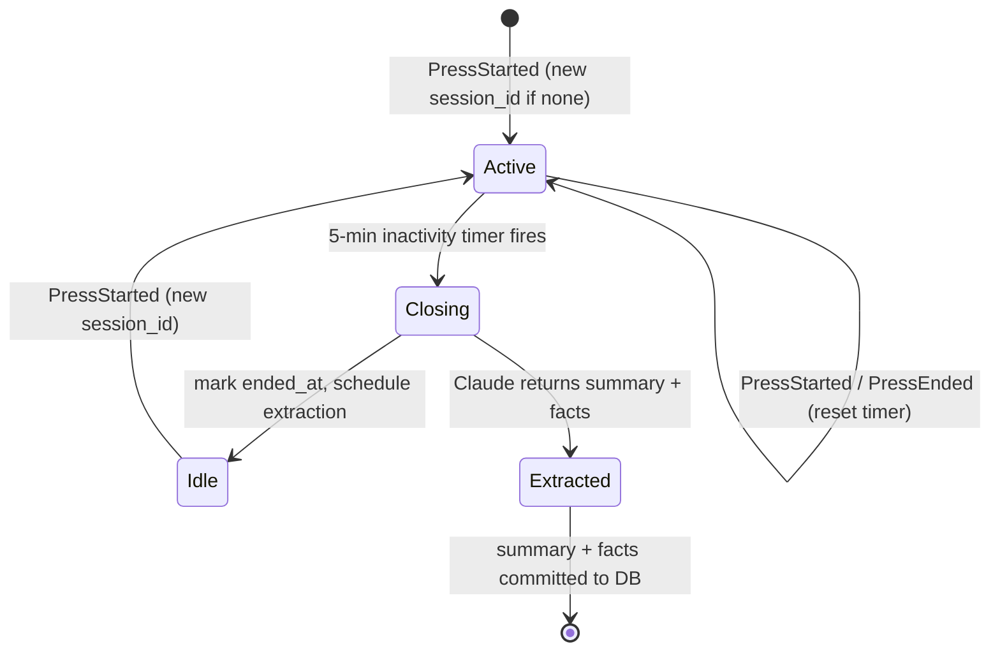

# Herbert persistent memory (v1)

## Overview

Replace `InMemorySession` (the current default, which forgets everything on daemon restart) with a SQLite-backed persistence layer that gives Herbert two always-loaded tiers of memory: durable **facts** about Matt, and **recent session summaries** for continuity. A single SQLite file at `~/.herbert/memory.db` holds all three tiers (facts, sessions, raw turns); v1 reads only facts + summaries on the hot path. Tier 3 (experiential FTS5 recall) is deferred to v2 but the raw turns table is populated from day one so no migration is needed when it lights up.

Memory sections are injected into the system prompt so Anthropic's prompt cache absorbs the added tokens after the first turn in a ~5-min burst. A second Claude call fires at session close (5-min inactivity) to distill new facts + a navigation-hook summary. The exact system prompt Claude receives is inspectable through a new `/api/prompt/snapshot` endpoint and a Prompt subview inside the existing diagnostic overlay.

## Problem Frame

Herbert's product claim is that it feels like *a specific little guy* that knows Matt. Today it collapses that illusion every boot — Matt has to re-introduce himself, can't reference yesterday's chat, and Herbert gives generic replies to context-sensitive questions. The fix is making Herbert feel like it *learns more about Matt over time* without slowing down the voice pipeline or burdening the Pi as data accumulates. See origin: docs/brainstorms/2026-04-19-herbert-memory-requirements.md.

## Requirements Trace

- R1. Facts (distilled identity + preferences) are injected into the system prompt every turn (see origin: Architecture tier 1).
- R2. Recent session summaries (last N) are appended to the system prompt every turn for continuity (see origin: Architecture tier 2).
- R3. Raw per-turn messages are persisted from day one so v2 FTS5 recall needs no data migration (see origin: Storage schema + v2 scope).
- R4. A session closes after 5 minutes of inactivity; at close, a second Claude call produces a summary + new facts (see origin: Write triggers).
- R5. Memory writes must not stall the voice pipeline's audio/latency budget (see origin: Operational choices).
- R6. The full assembled system prompt is inspectable at boot (log) and at any time via the diagnostic overlay (see origin: Observability).
- R7. Memory can be globally disabled via config, reverting Herbert to `InMemorySession`-only behavior (see origin: User-facing UX — Privacy/Transparency).
- R8. Storage stays under 100 MB at 10 years of heavy use with no pruning; projected ~15 MB/year at medium use (see origin: Storage projections, Success criteria).
- R9. Boot-to-ready time is unchanged (DB open budget: <100 ms) and per-turn LLM latency is unchanged within noise (cached prompt prefix) (see origin: Success criteria).

## Scope Boundaries

- **Non-goals in v1:** semantic/embedding recall, multi-user memory, cloud sync, offline operation (all per origin Non-goals).
- **No fact contradiction/reconciliation logic:** most recent wins; old facts age out naturally via `last_confirmed`. Revisit only if it becomes a problem.
- **No messages-table compaction:** text is cheap; projections show no pressure for many years.
- **No inline tools (`remember`, `forget`, `recall_memory`) in v1:** those are v2 work.
- **No web UI memory panel beyond the diagnostic snapshot:** the new endpoint is the seed; a first-class panel is a future consideration.

### Deferred to Separate Tasks

- **v2 — FTS5 + inline tools:** `messages_fts` virtual table, `recall_memory(query, after, limit)` + `remember(fact)` + `forget(fact_query)` tool declarations and handlers, persona addendum teaching Claude when to reach for each. Separate PR after v1 lands.
- **CLI `herbert memory` subcommand:** list-facts / forget by id. Only if inline edit via `sqlite3` proves painful.
- **Persona hot-reload of extraction prompt:** the v1 extraction prompt is hardcoded in Python; promoting it to `assets/prompts/extraction.md` is future work if iteration proves slow.

## Context & Research

### Relevant Code and Patterns

- `src/herbert/session.py` — `Session` Protocol + `InMemorySession`. The placeholder `SqliteSession` this plan lights up.
- `src/herbert/daemon.py` — `DaemonDeps`, `Daemon.__init__(session=...)`, `_resolve_persona()`, `_reconcile_session_after_cancel()`, `build_and_run()`. Memory wiring slots into `build_and_run`; persona assembly is extended in `_resolve_persona`.
- `src/herbert/llm/claude.py::stream_turn` — calls `session.append(user)` on entry and `session.append(assistant)` on clean completion. `SqliteSession` must behave correctly under the same barge-in/pop_last/replace_last flow `_reconcile_session_after_cancel` exercises.
- `src/herbert/boot_snapshot.py` — already has a comment explicitly earmarking memory-tier extension: `build_snapshot` takes `persona_text` (the fully-assembled system prompt) so section breakdown + facts + summaries land naturally once persona assembly knows about memory.
- `src/herbert/persona.py::PersonaCache` — mtime-tracked loader with last-good-cached fallback. Good shape reference for how the memory subsystem handles runtime failure (warn + keep serving stale rather than brick the voice loop).
- `src/herbert/config.py` — dataclass + TOML loader + allowed-key validation. New `MemoryConfig` section follows the existing pattern.
- `src/herbert/web/app.py::/api/boot_snapshot` — the pattern the new `/api/prompt/snapshot` endpoint mirrors (snapshot accessor, bearer auth, JSON body).
- `src/herbert/web/server.py` — `WebServer._snapshot_provider` attribute assignment pattern shows how the daemon injects live providers into the web thread after startup.
- `frontend/src/diagnostic.js` — existing overlay with a Boot-snapshot section; the Prompt subview lands as a sibling section.
- `src/herbert/llm/tools.py::TOOLS_PERSONA_ADDENDUM` — the existing pattern of appending addendum text to the persona when tools are active. Memory sections follow the same append-after-persona pattern.

### Institutional Learnings

- From the v1 implementation plan (`docs/plans/2026-04-18-001-feat-herbert-v1-implementation-plan.md` scope notes and Unit 11 / Unit 12 / Unit 12b commits): the voice loop is allergic to anything that blocks the event loop. Disk I/O on the turn path must be off-thread or `asyncio.to_thread`-wrapped, following the same discipline the warmup / health-check decisions enforced.
- The diagnostic panel + per-turn structured log pattern (commit 23be603, cbb80e8) is the template for the "per-turn prompt-delta structured log line" this plan adds.
- Fallback discipline: when a runtime file read fails mid-conversation (persona case), keep the last-good cached content and warn. The same rule applies to memory — a transient SQLite error reading facts should not brick a turn; fall back to empty/stale facts and log.

### External References

- Anthropic prompt caching: system prompts up to the cache-controlled prefix are billed at ~10% of normal and process ~2x faster. Memory sections are stable within a ~5-min burst, so they fall inside the cache window naturally if placed before the conversation messages.
- SQLite WAL mode: enables concurrent reads + single-writer without blocking; standard choice for single-file single-writer workloads like this.

## Key Technical Decisions

- **One SQLite file at `~/.herbert/memory.db`** — simplest backup (`cp`), respects filesystem permissions, inspectable with the `sqlite3` CLI, no additional services to run on the Pi.
- **Schema lands complete on v1** — `messages`, `sessions`, `facts` tables plus indexes; FTS5 virtual table + triggers deferred to v2 as an ALTER-free addition. Rationale: lets v1 populate raw turns immediately so v2 has backfill already done.
- **WAL journal mode + synchronous=NORMAL** — concurrent reader (extractor, `/api/prompt/snapshot`) without blocking writer (turn path).
- **Write-through `SqliteSession` with an in-memory mirror for the current session** — `messages` property serves from an in-memory list (fast, no per-turn DB read); `append()` enqueues a write-through to SQLite and returns synchronously with the generated `turn_id`. `pop_last()` / `replace_last()` update the in-memory mirror immediately and enqueue the corresponding DB mutation. Rationale: matches the Session Protocol semantics already exercised by `_reconcile_session_after_cancel` without changing the barge-in contract, and survives crashes mid-session for anything the writer has already drained.
- **Disk I/O is off the event loop via a dedicated writer thread** — `MemoryStore` owns a daemon thread that drains a `queue.Queue` of write operations (INSERT, DELETE, UPDATE). The thread holds a writer-side `sqlite3.Connection`. Callers (`SqliteSession.append`, close_session) enqueue ops and return immediately — the event loop never blocks on disk. This is the requirements doc's explicit design intent ("Writes dispatched to a background task... so the audio path never stalls on disk I/O"). SD card spikes on a Pi (50-100ms+ for occasional checkpoint pauses) do not propagate into TTFT.
- **IDs are generated in-caller, not in the writer** — `turn_id` ULIDs are allocated at `append_turn` call time and returned synchronously. The writer thread applies the INSERT using that exact id. This means `pop_last(turn_id)` / `replace_last(turn_id, ...)` can enqueue a DELETE/UPDATE keyed by the captured id and the FIFO queue guarantees the ops land in caller-order, even if the initial INSERT hasn't executed yet — SQLite sees them in the right sequence.
- **Reads happen directly on the calling thread against a second connection** — `MemoryStore` opens a reader-side `sqlite3.Connection` with `check_same_thread=False` for `get_facts`, `get_recent_summaries`, `get_session_turns`. SQLite WAL allows concurrent readers during a writer's active transaction; there's no coordination needed beyond the two-connection split.
- **Shutdown drains the writer queue** — `MemoryStore.close()` puts a sentinel on the queue, joins the writer thread (bounded timeout, e.g. 2s), then closes both connections. Pending writes land before shutdown unless the timeout fires; on timeout we log a WARN and proceed — the next boot reads whatever persisted, no corruption possible with WAL.
- **Extraction is a single hardcoded Claude call with structured output (JSON)** — prompt lives as a Python string literal in `memory/extractor.py` for v1. JSON response is parsed with `json.loads` inside a `try/except` block; failure → skip. Promoting to a file-backed prompt is deferred.
- **Extraction runs on the same `AsyncAnthropic` client** passed to the daemon via `DaemonDeps`. Same model as turns (`claude-sonnet-4-6`) — Sonnet's better at faithful summarization than Haiku and cost at session-close cadence is negligible.
- **Facts are rendered with the timestamp-free flat bullet list** (no per-fact confidence scores or provenance). Dedup is by `content` uniqueness at `add_fact` time; `last_confirmed` is updated on duplicate insert.
- **System prompt order for cacheability:** `persona → tools-addendum → ## What I know about Matt (facts) → ## Recent sessions (summaries)`. Stable for the entire burst; conversation messages go in the `messages` array and are the only non-cached delta.
- **Session boundary = 5 min of inactivity** — an async timer inside the daemon resets on every `PressStarted`/`PressEnded`. On fire: record `ended_at`, schedule extraction (background task), allocate a new `session_id` on the next press.
- **`memory.enabled=False` keeps the current `InMemorySession` path exactly as-is** — the daemon branches once in `build_and_run` between constructing a `SqliteSession(store)` and a bare `InMemorySession()`.
- **Separate `/api/prompt/snapshot` endpoint** (not an extension of `/api/boot_snapshot`) — boot snapshot stays focused on config + boot-time prompt; the prompt snapshot is per-request, includes live session messages, and has its own shape (per-section token estimates).

## Open Questions

### Resolved During Planning

- **Where does the extraction prompt live?** Hardcoded Python string literal in `src/herbert/memory/extractor.py`. Tune over time based on observed output quality; promote to a file only if iteration gets painful (see origin question 1).
- **What if extraction runs during the next session?** The new session starts with whatever facts are committed *at the time of the first turn*. New facts from the previous session may not be visible until extraction finishes; they'll be there next session. No blocking, no coordination. (see origin question 2).
- **Do we expose memory in the web UI beyond the diagnostic snapshot?** Out of scope for v1; the endpoint is the seed (see origin question 3 — deferred).
- **Separate endpoint or extend `/api/boot_snapshot`?** Separate `/api/prompt/snapshot` — per-request, includes live session messages, has its own shape.
- **Does `InMemorySession` stay?** Yes — used when `memory.enabled=False` and in tests that don't want SQLite.
- **Writer strategy inside `MemoryStore`:** Dedicated daemon thread draining a `queue.Queue` (not `asyncio.to_thread`, not `asyncio.Queue`). Rationale: the Session Protocol's `append()` is sync and called from inside `stream_turn` on the event loop — a queue fed by sync callers and drained by a thread is the simplest fit and fully decouples disk I/O from the voice loop. The thread owns a dedicated writer connection; reads use a separate `check_same_thread=False` connection so web/event-loop/extractor threads can all read concurrently during writes.
- **Whether `pop_last()` issues a hard DELETE:** Hard DELETE by captured `turn_id`. Rationale: (a) keeps the schema simple; (b) FIFO queue ordering makes the race with a not-yet-drained INSERT impossible; (c) barge-in audit trail isn't load-bearing — the logged transcripts and the state-machine events in the bus already record that information.
- **Timer reset mechanism:** Direct call inline in `_publish_turn_completed` (not a bus-subscribe task). Keeps reset atomic with turn completion and avoids cross-task ordering ambiguity with `_on_press_started`.
- **Session allocation timing:** Lazy. `store.start_session()` runs on first `PressStarted`, not at daemon boot. No empty sessions rows on restart.
- **`Session` Protocol surface:** Unchanged. `replace_last` remains an instance-only method on both `InMemorySession` and `SqliteSession`, and `daemon.py` continues to use `hasattr(session, "replace_last")`.

### Deferred to Implementation

- **Exact token estimate breakdown helper signature in `memory/prompt.py`:** the requirements doc lists persona/tools/facts/summaries as the sections; whether to split tools into `tool-specs` vs. `tools-addendum` is a cosmetic choice for the Prompt subview.
- **Exact writer-thread shutdown timeout:** 2s is the plan's working value, but the right budget is "longer than the 99th-percentile queue drain on a loaded Pi, shorter than a user's patience for `Ctrl-C`." Calibrate in Unit 7 integration tests.

## Output Structure

    src/herbert/
      memory/
        __init__.py          # re-exports MemoryStore, MemoryConfig, open_store
        db.py                # connection + schema migration + WAL setup
        store.py             # MemoryStore (append_turn, close_session, get_facts, ...)
        extractor.py         # Claude-call session-close summary + fact extraction
        prompt.py            # build_system_prompt + token estimate breakdown
      session.py             # + SqliteSession (InMemorySession stays)
      config.py              # + MemoryConfig section
      daemon.py              # + inactivity timer + extraction scheduling + memory-aware persona assembly
      web/
        app.py               # + /api/prompt/snapshot endpoint
        server.py            # + prompt_snapshot_accessor wiring
    frontend/src/
      diagnostic.js          # + Prompt subview alongside Boot-snapshot

    tests/
      unit/
        test_memory_db.py
        test_memory_store.py
        test_memory_prompt.py
        test_memory_extractor.py
        test_session.py              # extend for SqliteSession
        test_config.py               # extend for MemoryConfig
      integration/
        test_memory_pipeline.py      # multi-turn + session close + extraction
        test_web_app.py              # extend for /api/prompt/snapshot
      e2e/
        test_memory_across_sessions.py  # replay fixture, 2 sessions with a gap

## High-Level Technical Design

> *This illustrates the intended approach and is directional guidance for review, not implementation specification. The implementing agent should treat it as context, not code to reproduce.*

### System prompt assembly per turn (the hot path)

```
assembled_system_prompt =
    persona_cache.get_current()
  + (TOOLS_PERSONA_ADDENDUM if tools else "")
  + "\n\n## What I know about Matt\n"   + render_facts(store.get_facts())
  + "\n\n## Recent sessions\n"          + render_summaries(store.get_recent_summaries(n=5))
```

Cacheable prefix spans the entire string — stable within a burst. Conversation messages continue to travel in the `messages` array untouched.

### Session lifecycle (daemon loop)



Extraction runs in a background task — it does NOT block `Idle → Active` on the next press.

### Data flow on turn append (event-loop-safe)

```
[event loop thread]                                   [writer thread]
stream_turn
  → session.append(Message(user, ...))
      → generate turn_id (ULID)
      → _messages.append(msg); remember turn_id
      → store.append_turn(op=INSERT, turn_id, ...) ──→ queue ──→ conn.execute INSERT
      ← return turn_id                                                  │
  (stream_turn continues Claude call)                                    │
                                                                         ▼
                                                               rows in messages table

[reads use a separate connection on the calling thread, no queue]
snapshot endpoint → store.get_facts() → conn_reader.execute SELECT
```

On barge-in with zero tokens: `session.pop_last()` pops the in-memory mirror and enqueues a `DELETE WHERE turn_id=?` keyed by the captured id — FIFO preserves the INSERT→DELETE order even if the INSERT hasn't drained yet.

## Implementation Units

- [ ] **Unit 1: Memory config section**

**Goal:** Add a `MemoryConfig` dataclass to `HerbertConfig` so downstream units have a typed surface to read from.

**Requirements:** R7, R8

**Dependencies:** None

**Files:**
- Modify: `src/herbert/config.py`
- Modify: `tests/unit/test_config.py`

**Approach:**
- Add `MemoryConfig` with: `enabled: bool = True`, `db_path: Path = Path.home() / ".herbert" / "memory.db"`, `inactivity_seconds: int = 300`, `recent_sessions_count: int = 5`.
- Wire into `HerbertConfig` as `memory: MemoryConfig = field(default_factory=MemoryConfig)`.
- Add `"memory"` to `_TOP_LEVEL_SECTIONS` and `memory` to the `section_map` in `_build_config`.
- `as_dict` already recurses through dataclasses — no change needed.

**Patterns to follow:**
- Mirror `LoggingConfig` exactly (small dataclass with simple scalar fields, wired into `section_map`).

**Test scenarios:**
- Happy path: default `HerbertConfig()` has `memory.enabled=True`, `memory.inactivity_seconds=300`, `memory.recent_sessions_count=5`, `memory.db_path` ending in `memory.db`.
- Happy path: TOML `[memory]` section with `enabled=false` loads a config where `memory.enabled` is False.
- Happy path: TOML `[memory]` with `inactivity_seconds=600` overrides the default; unspecified keys keep defaults.
- Edge case: unknown key under `[memory]` → `ValueError` mentioning `MemoryConfig` (existing `_build_section` coverage; assert the new type appears in the raise).
- Happy path: `as_dict(cfg)` includes a `memory` key whose value is a dict with all four fields and `db_path` rendered as `str`.

**Verification:**
- `uv run pytest tests/unit/test_config.py` passes with the new scenarios.
- `uv run ruff check src tests` clean.

---

- [ ] **Unit 2: Memory DB + schema migration**

**Goal:** Ship the SQLite substrate — two connection openers (writer + reader), schema migration (idempotent), WAL setup — so stores can be constructed against a real file.

**Requirements:** R3, R8

**Dependencies:** Unit 1

**Files:**
- Create: `src/herbert/memory/__init__.py`
- Create: `src/herbert/memory/db.py`
- Create: `tests/unit/test_memory_db.py`

**Approach:**
- `db.py::open_writer_connection(path: Path) -> sqlite3.Connection` opens the file (creating parent dirs if needed), sets `PRAGMA journal_mode=WAL; PRAGMA synchronous=NORMAL; PRAGMA foreign_keys=ON;`, invokes `migrate(conn)`, and returns the connection. Default `check_same_thread=True` — this connection is pinned to the writer thread.
- `db.py::open_reader_connection(path: Path) -> sqlite3.Connection` opens a second connection with `check_same_thread=False` (so `/api/prompt/snapshot` from the web thread, `get_facts` from the event loop, and the extractor task can all use it). No migration — reader assumes the writer already ran migrate. WAL mode + two connections gives concurrent reader + writer without locking.
- `migrate(conn)` runs a single `schema_version` tracking table + the three v1 tables + indexes. Idempotent — re-running on an already-migrated DB is a no-op.
- Schema per origin doc: `messages(turn_id TEXT PK, session_id TEXT NOT NULL, ts INTEGER NOT NULL, role TEXT NOT NULL, content TEXT NOT NULL)`, `sessions(session_id TEXT PK, started_at INTEGER NOT NULL, ended_at INTEGER, summary TEXT)`, `facts(fact_id INTEGER PK AUTOINCREMENT, content TEXT NOT NULL UNIQUE, source_session TEXT, first_seen INTEGER NOT NULL, last_confirmed INTEGER NOT NULL)`, plus `idx_messages_session`, `idx_messages_ts`.
- Export `open_writer_connection`, `open_reader_connection`, `migrate` from `memory/__init__.py`.

**Execution note:** Write a failing test for `migrate` being idempotent, then implement.

**Patterns to follow:**
- Stdlib `sqlite3` with a module-local `logging.getLogger(__name__)` for schema-change logs at INFO.
- Follow `src/herbert/persona.py` for tight single-purpose module shape + docstring top-matter.

**Test scenarios:**
- Happy path: `open_writer_connection(tmp_path / "memory.db")` creates the file, journal mode reports `wal`, schema_version is set, all three tables + two indexes exist (query `sqlite_master`).
- Happy path: calling `migrate` twice on the same connection is a no-op — schema_version unchanged, no duplicate index errors.
- Happy path: `open_reader_connection` returns a connection where `check_same_thread` is False (verify via `conn._check_same_thread` or equivalent), and it can read rows written by the writer from a different thread without `ProgrammingError`.
- Happy path: `messages` accepts inserts with all required columns; `sessions` + `facts` same; `facts.content` UNIQUE constraint rejects duplicate content on second insert.
- Edge case: `open_writer_connection` on a path whose parent directory does not exist creates the parent dir (same behavior as persona/config paths in the rest of the project).
- Error path: opening against a path that is an existing directory (not a file) raises a clear error — do not silently partial-init.
- Integration: thread A writes via the writer connection while thread B reads via the reader connection — thread B sees the row after thread A commits, neither blocks the other.

**Verification:**
- Opened DB file reports `journal_mode=wal` via `PRAGMA journal_mode;`.
- `uv run pytest tests/unit/test_memory_db.py` passes.

---

- [ ] **Unit 3: MemoryStore — writer thread + read/write API**

**Goal:** Expose the vocabulary the rest of the system speaks. Writes go through a queue to a daemon writer thread; reads go direct on the caller's thread against a second connection. IDs are generated in-caller so writes can be fire-and-forget without losing return values.

**Requirements:** R1, R2, R3, R5, R8

**Dependencies:** Unit 2

**Files:**
- Create: `src/herbert/memory/store.py`
- Modify: `src/herbert/memory/__init__.py` (re-export `MemoryStore`)
- Create: `tests/unit/test_memory_store.py`

**Approach:**

*Construction + lifecycle:*
- `MemoryStore(db_path: Path)` opens both the writer and reader connections via Unit 2's helpers, starts a daemon thread that drains `self._queue: queue.Queue`, and stores the thread handle.
- `close()` enqueues a `_SHUTDOWN` sentinel, `self._writer_thread.join(timeout=2.0)`, then closes both connections. Called by `build_and_run`'s `finally`.

*Write methods — return immediately, enqueue to writer:*
- `start_session() -> str` generates a new ULID (`ulid-py` is already a dep), enqueues `("INSERT_SESSION", session_id, started_at)`, returns `session_id` synchronously.
- `append_turn(session_id, role, content) -> str` generates a new ULID `turn_id` + `ts = int(time.time())`, enqueues `("INSERT_TURN", turn_id, session_id, ts, role, content)`, returns `turn_id`.
- `pop_turn(turn_id)` enqueues `("DELETE_TURN", turn_id)`. Fire-and-forget (no return value needed; caller already has the popped message from their in-memory mirror).
- `replace_turn(turn_id, role, content)` enqueues `("UPDATE_TURN", turn_id, role, content)`.
- `close_session(session_id, summary, new_facts)` enqueues a single compound op `("CLOSE_SESSION", session_id, ended_at, summary, new_facts)`; the writer executes it inside a single SQLite transaction (UPDATE sessions + INSERT OR IGNORE each fact + UPDATE facts.last_confirmed on conflict) so atomicity lives inside the writer thread, not the caller.

*Read methods — direct on caller thread using reader connection:*
- `get_facts() -> list[str]` — SELECT content FROM facts ORDER BY fact_id ASC.
- `get_recent_summaries(n) -> list[tuple[str, int]]` — SELECT summary, ended_at FROM sessions WHERE summary IS NOT NULL ORDER BY ended_at DESC LIMIT n.
- `get_session_turns(session_id) -> list[Message]` — SELECT role, content FROM messages WHERE session_id=? ORDER BY ts ASC. Needed by the extractor (Unit 5) at session close to feed turns into Claude.

*Reader concurrency:*
- The reader connection is opened `check_same_thread=False` so the same `MemoryStore` instance serves reads from the event loop, the web thread, and the extractor task.
- A light `threading.Lock` around the reader connection's `execute/fetchall` block prevents SQLite's own "Recursive use of cursors not allowed" surprise when two threads hit `get_facts` simultaneously. Writes hold no such lock — they're single-threaded by virtue of the writer thread.

**Execution note:** Write failing unit tests for queue-based writes (enqueue → wait for drain → assert row appears), then implement the writer thread.

**Patterns to follow:**
- Connection lifecycle: `MemoryStore.close()` in `build_and_run`'s `finally`, mirroring `WebServer.stop()`.
- Logging discipline: WARN on writer-thread exceptions, never let one exception kill the writer loop — wrap each op in `try/except` and keep draining.

**Test scenarios:**
- Happy path: `start_session` returns a valid ULID synchronously; after a brief wait for queue drain, the row appears in `sessions` with `ended_at=None` and `summary=None`.
- Happy path: `append_turn(s, "user", "hi")` returns a `turn_id` synchronously; after drain, the row exists with that id.
- Happy path: `append_turn` then `pop_turn(turn_id)` in rapid succession — FIFO queue guarantees the DELETE runs after the INSERT; final DB state has no row for that turn_id (even though the caller didn't wait between ops).
- Happy path: `replace_turn(turn_id, "assistant", "new content")` updates both columns.
- Happy path: `close_session(s, "summary", ["fact a", "fact b"])` drains to a single committed transaction — `ended_at`, `summary`, and both facts all land; verify via three SELECTs.
- Happy path: `add_fact` (exercised via `close_session`) on duplicate `content` bumps `last_confirmed`, does NOT insert a new row.
- Happy path: `get_facts()`, `get_recent_summaries(n)`, `get_session_turns(session_id)` return expected shapes.
- Edge case: `close()` with no in-flight writes returns promptly (under 100ms).
- Edge case: `close()` while 10 writes are queued drains all of them before returning (or logs a timeout and proceeds).
- Edge case: `get_recent_summaries(5)` when only 2 sessions have non-null summaries returns 2 rows.
- Edge case: `get_session_turns` on a session_id with no messages returns an empty list.
- Integration (within-unit): multi-threaded reads — two threads call `get_facts()` concurrently while a third enqueues writes; neither reader raises, results are consistent.
- Integration: writer-thread exception in one op (e.g., malformed DELETE with unknown turn_id) is logged but the writer keeps draining subsequent ops.

**Verification:**
- `uv run pytest tests/unit/test_memory_store.py` passes.
- `MemoryStore.close()` cleanly shuts down the writer thread without "Thread still running" warnings.

---

- [ ] **Unit 4: System prompt builder**

**Goal:** A pure helper that takes `(persona_text, tools_active, facts, summaries)` and returns the fully-assembled system prompt + a token breakdown dict. Shared by the daemon's per-turn assembly AND the Prompt snapshot endpoint so they cannot drift.

**Requirements:** R1, R2, R6, R9 (cache-friendly ordering)

**Dependencies:** Unit 1 (config) only — no runtime DB needed

**Files:**
- Create: `src/herbert/memory/prompt.py`
- Create: `tests/unit/test_memory_prompt.py`
- Modify: `src/herbert/memory/__init__.py` (re-export `build_system_prompt`)

**Approach:**
- `build_system_prompt(*, persona: str, tools_addendum: str | None, facts: list[str], summaries: list[tuple[str, int]]) -> tuple[str, dict[str, int]]`
- Ordering: `persona.rstrip() + (tools_addendum or "") + "\n\n## What I know about Matt\n" + facts_block + "\n\n## Recent sessions\n" + summaries_block`.
- `facts_block` renders each fact as a `- {content}` line; empty list → `"_(no facts learned yet)_"` so the section is visibly present in the snapshot but has no misleading content. Omitting the section entirely would change the cacheable prefix across facts-vs-no-facts transitions.
- `summaries_block` renders each `(summary, ended_at)` as `- {human_date(ended_at)}: {summary}` where `human_date` is `time.strftime("%a %b %-d", time.localtime(ts))` (e.g., `Thu Apr 18`).
- Token breakdown dict: `{"persona": est(persona), "tools": est(tools_addendum), "facts": est(facts_block), "summaries": est(summaries_block), "total": est(full)}`. Re-use `boot_snapshot.estimate_tokens`.

**Patterns to follow:**
- Pure function + plain-dict return, no classes. Mirror `boot_snapshot.build_snapshot` return shape for consistency.

**Test scenarios:**
- Happy path: full prompt with persona + tools_addendum + 2 facts + 1 summary contains the two `## ` headers in the expected order and positions.
- Happy path: empty facts renders the `(no facts learned yet)` placeholder.
- Happy path: empty summaries renders an analogous placeholder — always preserve section headers so cache prefix is stable across "no content" vs "content" transitions.
- Happy path: `tools_addendum=None` omits the tools addendum but keeps facts + summaries sections intact.
- Happy path: token breakdown dict sums to within 1 token of the `total` estimate (allow rounding slack).
- Edge case: very long fact or summary content is rendered verbatim (no truncation in this helper — that's an extraction/storage concern).
- Happy path: ordering is deterministic across repeated calls with the same inputs (no set iteration, no random).

**Verification:**
- `uv run pytest tests/unit/test_memory_prompt.py` passes.
- Inspect one rendered output by eye against a fixture string to catch any surprise whitespace.

---

- [ ] **Unit 5: Session-close extractor**

**Goal:** A Claude-call wrapper that takes a closed session's turns + the existing fact list and returns `(summary: str | None, new_facts: list[str])`. Isolated from the daemon so tests can exercise it with a stub client.

**Requirements:** R4

**Dependencies:** Unit 3 (MemoryStore — extractor reads turns + existing facts through it)

**Files:**
- Create: `src/herbert/memory/extractor.py`
- Create: `tests/unit/test_memory_extractor.py`
- Modify: `src/herbert/memory/__init__.py` (re-export `extract_session_summary`)

**Approach:**
- `async def extract_session_summary(*, client, model: str, turns: list[Message], existing_facts: list[str]) -> tuple[str | None, list[str]]`
- Build a single message request to Claude with a hardcoded system prompt (literal string in the module) instructing: (a) produce a 1-2 sentence summary with dates/topics/entities; (b) produce a list of NEW durable facts about Matt, deduplicated against the provided `existing_facts`; (c) return ONLY JSON with shape `{"summary": "...", "new_facts": ["...", "..."]}` and nothing else.
- Send the turns as a single user message serialized as `user: ...\nassistant: ...\n...`.
- Parse the response text; on `json.JSONDecodeError` OR missing keys → log a WARN and return `(None, [])`.
- On any `anthropic` exception → retry once with a 500ms sleep; on second failure → log WARN and return `(None, [])`. Never raise to caller.
- Empty `turns` (0 messages) → return `(None, [])` without calling Claude.
- Use `max_tokens=512` — summaries + facts are short.

**Patterns to follow:**
- `src/herbert/llm/claude.py` for SDK usage shape (`async with client.messages.stream(...)` — actually use non-streaming `client.messages.create` here since we want the whole response at once).
- Error classification + retry posture from `src/herbert/daemon.py::_monitor_recovery` — conservative, logged, never bricks the caller.

**Test scenarios:**
- Happy path: client returns `{"summary": "chat about X", "new_facts": ["Matt likes Y"]}` → `(summary, facts)` returned verbatim.
- Happy path: client returns `new_facts` that overlap with `existing_facts` — extractor dedups so returned list has only genuinely new ones. (If extractor trusts Claude to dedup, assert that and add a defensive `set`-based filter anyway.)
- Happy path: empty turns → no client call, returns `(None, [])` immediately (mock: assert `client.messages.create` not called).
- Error path: client raises `anthropic.APIError` once then succeeds → extractor retries once and returns the second response.
- Error path: client raises twice → extractor returns `(None, [])` and logs WARN.
- Error path: client returns malformed JSON (missing closing brace) → returns `(None, [])`, logs WARN.
- Error path: client returns valid JSON missing the `summary` key → returns `(None, [])`, logs WARN.
- Edge case: client returns `new_facts: []` — returns `(summary, [])` (summary still useful on its own).
- Integration: Run against a real-shape Claude response fixture (captured JSON from a practice run) and verify parse.

**Verification:**
- `uv run pytest tests/unit/test_memory_extractor.py` passes.
- Never raises an exception from any path (verified by test matrix).

---

- [ ] **Unit 6: SqliteSession — Session Protocol implementation**

**Goal:** A `Session` that behaves identically to `InMemorySession` from the consumer's viewpoint. Appends enqueue a write-through to `MemoryStore`; pops/replaces use the captured `turn_id` so the writer's FIFO queue preserves caller-order even across fire-and-forget ops.

**Requirements:** R3, R5, R7

**Dependencies:** Unit 3 (MemoryStore)

**Files:**
- Modify: `src/herbert/session.py`
- Modify: `tests/unit/test_session.py`

**Approach:**
- `class SqliteSession` takes `(store: MemoryStore, session_id: str)`.
- Keeps two parallel lists in instance state: `_messages: list[Message]` (the in-memory mirror served by `.messages`) and `_turn_ids: list[str]` (the ULID assigned when each message was appended). Indexes stay aligned; `pop_last` pops the tail of both; `replace_last` reuses the last turn_id for the UPDATE.
- `append(msg)` → `turn_id = store.append_turn(session_id, msg.role, msg.content)` (returns immediately, enqueues the INSERT) → `_messages.append(msg); _turn_ids.append(turn_id)`.
- `pop_last()` → returns None if empty; else pops both lists, calls `store.pop_turn(turn_id)`, returns the popped `Message`.
- `replace_last(msg)` → raises `IndexError` if empty (matches `InMemorySession`); else updates in-memory and calls `store.replace_turn(turn_id, msg.role, msg.content)` reusing the last turn_id.
- `clear()` → clears both lists; does NOT touch the DB (the DB is a durable record — `clear()` is used in tests, not production).
- `replace_last` is an instance-only method on `SqliteSession`, matching how `InMemorySession` exposes it today. The `Session` Protocol does not gain `replace_last`; `daemon.py` continues to use the `hasattr(session, "replace_last")` guard (existing line). This is an intentional non-change — the Protocol's three core methods stay minimal.

**Execution note:** Write a characterization test that runs `InMemorySession`'s behavioral suite against `SqliteSession` (append/pop/replace/clear round-trip), then implement toward it.

**Patterns to follow:**
- `InMemorySession` in the same file for Protocol surface shape + docstring voice.
- `runtime_checkable Session` protocol — adding a new impl requires no interface change.

**Test scenarios:**
- Happy path: create SqliteSession, `append(user)` + `append(assistant)` → `.messages` returns a 2-element list; after queue drain, DB has 2 rows for the session in caller order.
- Happy path: `append(user)` then immediate `pop_last()` (no sleep between) → both lists empty; after queue drain, DB has 0 rows (FIFO queue preserved INSERT→DELETE order).
- Happy path: `pop_last()` after two appends returns the assistant Message; after drain, DB has 1 row (user only).
- Happy path: `replace_last(msg)` updates content in both halves; after drain, DB row shows new content under the same turn_id.
- Happy path: `clear()` empties in-memory lists; DB rows remain (confirmed by a direct `MemoryStore.get_session_turns` query).
- Edge case: `pop_last()` on an empty session returns None without a DB enqueue.
- Edge case: `replace_last(msg)` on an empty session raises `IndexError` like `InMemorySession`.
- Edge case: two `SqliteSession` instances against the same `MemoryStore` but different `session_id` do not interfere — each sees only its own in-memory mirror, and DB rows are correctly partitioned by session_id.
- Integration: the `_reconcile_session_after_cancel` flow — simulate a zero-token cancel, assert `pop_last()` cleans both halves AND the DB; simulate a ≥1-token cancel, assert `replace_last()` writes the `[interrupted]` marker to both halves.
- Integration: Session Protocol `isinstance(sess, Session)` passes (runtime_checkable).

**Verification:**
- `uv run pytest tests/unit/test_session.py` passes (both `InMemorySession` and `SqliteSession` suites).
- Existing `test_session.py` cases still pass — no regression.

---

- [ ] **Unit 7: Daemon wiring — memory lifecycle + memory-aware prompt + observability logs**

**Goal:** The integration glue that makes memory actually do something in `herbert dev`. This unit is the largest and touches several orchestration seams.

**Requirements:** R1, R2, R4, R5, R6, R7, R9

**Dependencies:** Units 3, 4, 5, 6

**Files:**
- Modify: `src/herbert/daemon.py`
- Modify: `tests/integration/test_memory_pipeline.py` (new file)

**Approach:**

*DB and store lifecycle (`build_and_run`):*
- Branch on `config.memory.enabled`. When enabled: `store = MemoryStore(config.memory.db_path)` — the store internally opens both connections and starts its writer thread. When disabled: `store = None` and the rest of memory integration becomes no-ops; daemon uses `InMemorySession()` as today.
- Register `store.close()` in the `finally` block of `build_and_run` alongside `web_server.stop()`.

*Lazy session allocation — no empty rows at boot:*
- `Daemon.__init__` accepts an optional `store` and a `session_factory: Callable[[], Session]`. When `store` is None, the factory returns a bare `InMemorySession()`. When `store` is present, the factory allocates a new `session_id` via `store.start_session()` and returns `SqliteSession(store, session_id)`.
- `Daemon._session` stays as `None | Session` until the first `PressStarted`; `_on_press_started` calls `_ensure_session()` which materialises the session lazily. This avoids creating a never-used `sessions` row on every daemon boot (a cleaner DB and truer semantic — "a session begins when Matt presses the button").

*Session closure + rotation:*
- On inactivity timer fire: read the session's turns snapshot via `store.get_session_turns(session_id)` and the current facts via `store.get_facts()` (both run on the event-loop thread against the reader connection). Seal the session immediately with `store.close_session(session_id, summary=None, new_facts=[])` so `ended_at` is set even if extraction fails.
- Schedule a background extraction task with the captured snapshot + existing-facts snapshot. When it returns, call `store.close_session(session_id, summary, new_facts)` a second time — the writer's compound op is idempotent for the summary/facts fields.
- After seal, set `self._session = None`. The next `PressStarted` re-materialises a fresh session via the factory. This keeps the swap simple and race-free.

*Inactivity timer:*
- Add `self._inactivity_task: asyncio.Task | None` to `Daemon`.
- Reset (cancel + restart) the timer on every `PressStarted` AND inline at the end of `_publish_turn_completed` (direct call, not bus-subscribe) — bus-subscribe would introduce an async handoff between the cancel and the reset, creating the kind of ordering ambiguity the barge-in flow already fights. A direct function call keeps the reset atomic with turn completion.
- On timer fire: call `Daemon._close_current_session()` which runs the closure+rotation above.

*Extraction scheduling:*
- `_schedule_extraction(session_id, turns_snapshot, existing_facts)` → `asyncio.create_task(...)` body: call `extract_session_summary`, then `store.close_session(session_id, summary, new_facts)`. Task is stored in `self._extraction_tasks: set[asyncio.Task]` (add on create, self-remove on done) so shutdown can await or cancel in-flight extractions.

*Persona assembly:*
- Extend `_resolve_persona()` to call `memory.prompt.build_system_prompt(persona=base, tools_addendum=..., facts=store.get_facts(), summaries=store.get_recent_summaries(config.memory.recent_sessions_count))` when store is present. When store is None, preserve the existing `base + TOOLS_PERSONA_ADDENDUM` string exactly.
- Cache the token-breakdown dict on `Turn.llm_state` (or a new `Turn.prompt_breakdown` attribute) so the per-turn log line can read it without rebuilding.

*Boot-time snapshot extension:*
- `_snapshot_provider` in `build_and_run` already receives the assembled persona for `build_snapshot`. Extend the callable to call the same `build_system_prompt` helper when memory is enabled, so the logged boot snapshot reflects facts + summaries from the first turn onward.

*Per-turn prompt-delta log line:*
- After each turn completes, log at INFO: `prompt.turn turn=<id> persona=<n> tools=<n> facts=<n> summaries=<n> live=<n> total=<n>` where `live` = live-session message token estimate.
- The origin doc sketched a `cached=<hit|unknown>` field; we're omitting it in v1 because the Anthropic streaming SDK doesn't surface a reliable cache-hit signal. If/when it does, add the field without a data-shape change.

**Execution note:** Start with an integration test that asserts cross-session facts appear in the second session's system prompt; then implement toward it.

**Patterns to follow:**
- Existing `_log_transcripts` subscribe-to-bus pattern for turn-completion triggers.
- Existing `_forward_bus_to_web` background task lifecycle — `asyncio.create_task` owned by Daemon, cancelled cleanly in the `finally` of `run()`.
- Existing `_monitor_recovery` conservative error posture — extraction failures log + continue, never brick.

**Test scenarios:**
- Happy path: daemon boots with `memory.enabled=True`, DB file is created but `sessions` is empty (no row until first press).
- Happy path: first `PressStarted` allocates a `session_id`, writes a `sessions` row; the turn's user + assistant messages land in `messages`.
- Happy path: two turns in one session then 5-min-of-silence fires the inactivity timer → `sessions.ended_at` is set, extraction task runs, `summary` + `facts` land.
- Happy path: after session close, a new `PressStarted` starts a new `session_id`; the new session's first turn sees the previous summary in its system prompt.
- Happy path: facts accumulated across two simulated sessions show up in `get_facts()` and in the system prompt sent to Claude.
- Happy path: `memory.enabled=False` makes the daemon use `InMemorySession`; no DB file is created.
- Edge case: daemon shutdown during an in-flight extraction task — `finally` block awaits `_extraction_tasks` briefly then cancels; no "task was destroyed pending" warnings.
- Edge case: daemon shutdown during in-flight writer queue — `store.close()` drains the queue within 2s; turns written before shutdown persist.
- Edge case: extraction task raises — `sessions.ended_at` remains set (sealed), summary/facts stay null, next session still boots normally.
- Edge case: inactivity timer fires while a turn is in-flight — no-op (timer only fires cleanly when state is idle AND no turn task is live).
- Edge case: barge-in (`PressStarted` during speaking) resets the inactivity timer; the session is NOT closed prematurely.
- Edge case: direct-hook timer reset in `_publish_turn_completed` fires before the next `PressStarted` can land (verifies the direct-call vs. bus-subscribe choice is working — no ordering ambiguity observable).
- Integration: per-turn log line emits once per completed turn with plausible token counts matching `build_system_prompt`'s breakdown.
- Integration: boot-time log snapshot includes facts + summaries when memory is enabled.
- Integration: `SqliteSession`'s turn appends do not add measurable latency to the event loop — turn completion wall-clock time is within noise of the non-memory baseline on a stub-client run (proves the writer thread decouples disk I/O).

**Verification:**
- `uv run pytest tests/integration/test_memory_pipeline.py` passes.
- Run `herbert dev` locally; `~/.herbert/memory.db` appears; `sqlite3 memory.db "SELECT * FROM messages LIMIT 5"` shows real turns.
- The per-turn `prompt.turn` log line appears in `~/.herbert/herbert.log` after each turn.

---

- [ ] **Unit 8: Prompt snapshot API + frontend Prompt subview**

**Goal:** Make the assembled system prompt + live session messages inspectable via a voice trigger + a scrollable panel inside the diagnostic overlay.

**Requirements:** R6

**Dependencies:** Units 4, 7

**Files:**
- Modify: `src/herbert/web/app.py` (add `/api/prompt/snapshot`)
- Modify: `src/herbert/web/server.py` (wire prompt snapshot accessor)
- Modify: `src/herbert/daemon.py` (register prompt snapshot provider, mirroring the boot_snapshot pattern)
- Modify: `frontend/src/diagnostic.js` (Prompt subview alongside Boot-snapshot)
- Modify: `tests/integration/test_web_app.py`

**Approach:**

*Endpoint shape:*
- `GET /api/prompt/snapshot` returns JSON: `{"persona": {"text": "...", "tokens": n}, "tools_addendum": {...}, "facts": {"items": ["..."], "tokens": n}, "summaries": {"items": [{"date": "Thu Apr 18", "summary": "..."}, ...], "tokens": n}, "live_messages": [{"role": "user", "content": "...", "ts": 123}, ...], "total_tokens": n}`.
- Auth: same bearer-dependency as `/api/boot_snapshot` (`make_http_dependency`).
- 503 if provider not yet configured (same pattern as `/api/boot_snapshot`).

*Server wiring:*
- `WebServer` gets a `_prompt_snapshot_provider` attribute and an `app.py`-side `snapshot_accessor` closure, mirroring the existing boot-snapshot accessor indirection.
- `build_and_run` registers the provider once `Daemon` is constructed.

*Daemon provider:*
- `_prompt_snapshot_provider()` returns a dict assembled from `persona_cache.get_current()`, tools state, `store.get_facts()`, `store.get_recent_summaries(N)`, and the current live `session.messages`.
- Gracefully handles `store=None` (memory disabled) — facts/summaries are empty lists but persona + live_messages still render.

*Frontend — Prompt subview specification:*

Section ordering inside the overlay, top-to-bottom: Boot snapshot (existing) → **Prompt** (new) → Live log (existing). The Prompt section is always rendered when memory is enabled and always expanded by default — it's the load-bearing feature, not a secondary detail.

Internal structure of the Prompt section (strictly top-to-bottom):
1. **Section header** with a small "↻ refresh" button on the right and a subtle "as of HH:MM:SS" timestamp showing when the displayed snapshot was fetched.
2. **Persona** — collapsible `<details>` (collapsed by default, it's long); summary shows `persona — N tokens`.
3. **Tools addendum** — same collapsible pattern; summary `tools — N tokens`. Hidden entirely (no row) when no tools are active.
4. **What I know about Matt (facts)** — always expanded; bulleted `<ul>` of fact strings. Empty list renders `<em>no facts learned yet</em>`. Summary `facts — N tokens`.
5. **Recent sessions** — always expanded; `<dl>` with `<dt>` showing human date, `<dd>` showing summary. Empty list renders `<em>no closed sessions yet</em>`. Summary `summaries — N tokens`.
6. **Live messages** — always expanded; scrollable `<ol>` capped at `max-height: 240px` with overflow-y:auto; each item a two-line block — first line role label (styled: user = accent color A, assistant = accent color B, no other roles expected in v1), second line the content. Timestamps omitted from the UI in v1 (data is available in the JSON for future use). Empty list renders `<em>no messages in this session yet</em>`.
7. **Total tokens** — single line at the bottom: `total ≈ N tokens`.

Interaction states — every state must have an explicit rendering:
- **Loading** (first open OR after refresh click): the Prompt section body is replaced with `loading…` (matching the existing Boot-snapshot loading text verbatim for consistency).
- **Error** (fetch fails OR 503 provider-not-ready): `prompt unavailable: <reason>` followed by the same ↻ refresh button so Matt can retry without closing the overlay.
- **Memory disabled** (`memory.enabled=false` → the endpoint returns empty items lists): the section still renders with the Persona + Tools sections populated, a small `<em>memory is disabled</em>` notice in place of the Facts and Recent-sessions sections, and Live messages rendered normally from the in-flight session.
- **Stale** (the displayed snapshot is older than 10s according to wall-clock): the "as of" timestamp text turns dim gray (CSS `opacity: 0.5`) to hint at staleness. No auto-refresh — explicit manual refresh keeps the UI predictable and doesn't fight the latency log output.

Fetch timing: on overlay open (`setView('diagnostic')`) and on ↻ click. No polling.

*No new voice trigger needed:* the existing diagnostic-mode trigger opens the whole overlay, and the Prompt subview is visible as a section within it. (The origin doc's optional "Herbert, show me the prompt" voice trigger is deferred to post-v1 if it proves useful.)

**Patterns to follow:**
- `/api/boot_snapshot` in `src/herbert/web/app.py` for endpoint shape, auth dependency, provider accessor indirection, and error envelope.
- `frontend/src/diagnostic.js::renderShell` + `fetchAndRenderSnapshot` for section-add pattern.

**Test scenarios:**
- Happy path: `/api/prompt/snapshot` returns 200 with all keys populated when the daemon has a session with 2 facts + 1 summary + 3 live messages.
- Happy path: `/api/prompt/snapshot` returns 200 with empty `items` and `live_messages` when memory is disabled.
- Happy path: The returned `total_tokens` equals the sum of the per-section tokens (round-trip with `build_system_prompt`).
- Error path: when the provider is not yet registered → 503 with `{"error": "snapshot provider not yet configured"}`.
- Auth: `/api/prompt/snapshot` requires the bearer token in `--expose` mode; 401 without it; 200 with it.
- Integration (frontend manual): build the frontend, open the overlay, verify section order (Boot snapshot → Prompt → Live log), verify facts/summaries/live-messages populate, verify refresh button re-fetches, verify stale-timestamp dims after 10s, verify memory-disabled notice renders correctly when toggled off.

**Verification:**
- `uv run pytest tests/integration/test_web_app.py` passes.
- `cd frontend && npm run build` succeeds; `herbert dev` opens the overlay and the Prompt subview populates.
- Bearer-token enforcement in `--expose` mode matches existing endpoints.

---

- [ ] **Unit 9: E2E cross-session replay fixture**

**Goal:** A single end-to-end test that proves the observable product win: across a simulated session boundary, Herbert's system prompt on the second session includes facts + a summary from the first.

**Requirements:** R1, R2, R4, R6

**Dependencies:** Units 7, 8

**Files:**
- Create: `tests/e2e/test_memory_across_sessions.py`
- Possibly create: `tests/fixtures/turns/memory-cross-session.json` (replay fixture)

**Approach:**
- Use the existing `replay_transport.py` / `conftest.py` e2e harness.
- Drive two sessions with a simulated 5-minute gap between them (advance the clock, not real sleep — the inactivity timer needs a monotonic-clock override or a direct `_close_current_session` call via a test-only hook).
- Session 1: user says "Hi, I'm Matt and I live in Upland." Claude replies; turn completes. Session closes. Extractor runs (use a deterministic stub client that returns a canned `{"summary": "...", "new_facts": ["Matt lives in Upland"]}`).
- Session 2: user asks anything. Assert that the system prompt sent to Claude on the first turn of session 2 contains `Matt lives in Upland` AND the session 1 summary.

**Patterns to follow:**
- Existing e2e fixtures under `tests/e2e/` (e.g., `test_multi_sentence.py`, `test_diagnostic_trigger.py`) for harness shape.
- `tests/e2e/replay_transport.py` for Claude-call stubbing.

**Test scenarios:**
- Happy path: facts from session 1 appear in the system prompt of session 2's first turn.
- Happy path: summary from session 1 appears in the "## Recent sessions" block in session 2.
- Happy path: session 1's own turns do NOT appear in session 2's `messages` array (live session is session 2 only).
- Edge case: extraction fails (stub raises) — session 2 still starts normally, with no new summary but existing (older) facts intact.
- Integration: the DB file survives the test run cleanly — no corruption, journal mode still WAL after the test.

**Verification:**
- `uv run pytest tests/e2e/test_memory_across_sessions.py` passes.
- Full suite: `uv run pytest` — target count ~300 tests (from current 287 + unit/integration/e2e additions), all green.
- `uv run ruff check src tests scripts` clean.

## System-Wide Impact

- **Interaction graph:** The 5-min inactivity timer becomes a new async task owned by `Daemon`, reset via direct inline call in `_publish_turn_completed` and on `PressStarted`. Extraction is another background task spawned at close-time; `self._extraction_tasks` set tracks in-flight tasks. The `MemoryStore`'s writer thread is a separate (non-asyncio) concern — daemon thread, drained on `store.close()`. All three lifecycles (inactivity task, extraction tasks, writer thread) must shut down cleanly in `build_and_run`'s `finally` alongside `_bus_forward_task` and `_transcript_log_task`.
- **Error propagation:** Memory-layer exceptions (DB read failure, extractor Claude-call failure, writer-thread op failure) are contained inside memory code and degrade to empty/stale values. They MUST NOT raise into `stream_turn` or the daemon's turn pipeline. Writer-thread exceptions log and keep draining; reader exceptions in `_resolve_persona` fall back to empty facts + summaries and log WARN. The persona-cache "keep last good + warn" pattern is the template.
- **State lifecycle risks:** Partial writes during close — if the daemon crashes between the initial `store.close_session(summary=None)` and extraction completing, the session is sealed but has no summary. This is acceptable: `get_recent_summaries` filters to non-null `summary`, so a half-closed session just doesn't contribute continuity. A future v2 might add a background "retry failed extractions" pass; out of scope for v1. `close_session`'s multi-row update atomicity lives inside the writer thread as a single SQLite transaction (BEGIN/COMMIT around the UPDATE + fact inserts), not on the caller side.
- **API surface parity:** `/api/boot_snapshot` and `/api/prompt/snapshot` share the snapshot-accessor indirection pattern. The bearer-token auth dependency applies identically.
- **Integration coverage:** Unit 7's integration tests must exercise the full `SqliteSession` + `_reconcile_session_after_cancel` interaction, not just the happy path — barge-in on a SqliteSession must behave identically to barge-in on `InMemorySession` from the daemon's viewpoint, including the captured-turn_id path for pop/replace.
- **Unchanged invariants:** The `Session` Protocol itself (`messages`, `append`, `clear`, `pop_last`) is NOT changed. `replace_last` remains instance-only on both impls (matches today's `hasattr` check in `_reconcile_session_after_cancel`). `InMemorySession` behavior is NOT changed. `stream_turn` is NOT changed — `session.append` still returns nothing from its perspective; the returned `turn_id` is captured inside `SqliteSession` for its own bookkeeping. The turn pipeline's state transitions are NOT changed. The only surface `stream_turn` sees differently is that `persona` now contains facts + summaries — but it's still a string, still passed via `system=`.

## Risks & Dependencies

| Risk | Mitigation |
|------|------------|
| SD card write spikes on the Pi propagate into turn latency | Writes run on a dedicated writer thread fed by a `queue.Queue`; `SqliteSession.append()` returns synchronously with the caller's `turn_id` and never awaits disk. Integration test in Unit 7 asserts turn wall-clock is within noise of the non-memory baseline |
| Writer queue grows unbounded if the writer thread stalls (e.g., disk-full) | Writer drains one op at a time in a `try/except` loop; unhandled exceptions are logged but don't kill the loop. If the queue ever grows past ~100 entries we emit a WARN (log-only in v1; a v2 follow-up could add backpressure) |
| Extraction prompt produces garbage facts (e.g., inferring the wrong name, fabricating preferences) | (a) extractor parses defensively and skips on malformed JSON, (b) `facts.content UNIQUE` dedup prevents exact-duplicate pollution, (c) Matt can edit `~/.herbert/memory.db` via `sqlite3`, (d) prompt is tunable over time, (e) v2 `forget` tool provides inline correction |
| Inactivity timer misfires during barge-in storms or error-recovery loops | Timer reset on every `PressStarted` AND inline in `_publish_turn_completed`; guarded to only fire when state == idle and no turn task is live |
| Boot time regresses because of DB open + migration | Open is <100ms for a small SQLite file (budgeted in R9); measured in Unit 7 integration tests; migration runs once per schema-version bump |
| Memory sections push total prompt past cacheable threshold, causing cache misses every turn | System prompt order places memory BEFORE live messages; sections are stable within a burst; facts/summaries change only at session-close (already a natural cache-miss boundary) |
| Extraction task backlog if the daemon restarts fast between sessions | `sessions.ended_at` is set before extraction runs, so the session is visibly sealed; a half-run extraction just leaves `summary=NULL` and the next summary query filters it out |
| Disabled memory config path regresses if not exercised | An explicit integration test for `memory.enabled=False` → `InMemorySession` path is part of Unit 7 |

## Documentation / Operational Notes

- README should gain a short "Memory" section: where the DB lives, how to inspect with `sqlite3`, how to disable via `config.memory.enabled=false`, how to wipe (`rm ~/.herbert/memory.db`).
- Default config TOML sample should show the `[memory]` section commented with defaults.
- The per-turn `prompt.turn` log line is greppable — note it in the diagnostics / troubleshooting section of the README alongside the existing `prompt.snapshot` boot line.

## Sources & References

- **Origin document:** [docs/brainstorms/2026-04-19-herbert-memory-requirements.md](../brainstorms/2026-04-19-herbert-memory-requirements.md)
- **Upstream plan:** [docs/plans/2026-04-18-001-feat-herbert-v1-implementation-plan.md](2026-04-18-001-feat-herbert-v1-implementation-plan.md) (Unit 13 placeholder lights up here)
- Related code: `src/herbert/session.py`, `src/herbert/daemon.py`, `src/herbert/boot_snapshot.py`, `src/herbert/persona.py`, `src/herbert/web/app.py`, `frontend/src/diagnostic.js`
